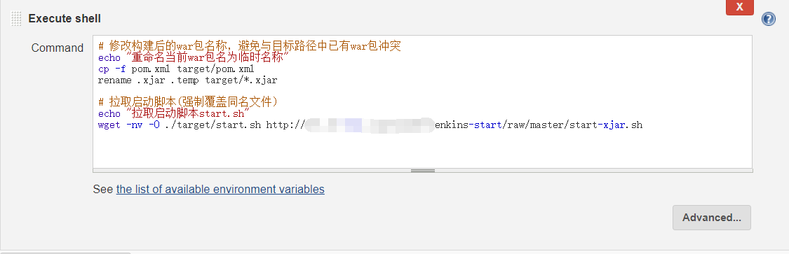
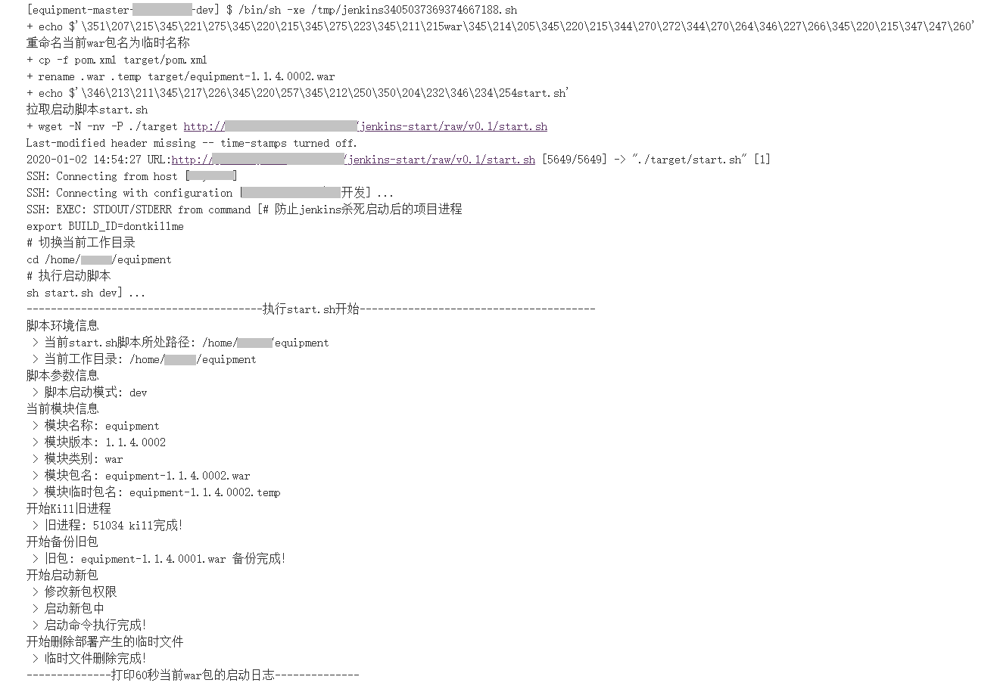

# jenkins-start
SpringCloud项目的jenkins部署启动脚本

## 功能说明
#### 主要功能：
1. 动态获取当前模块名（通过解析传递过来的pom.xml获得）
2. 杀死与当前模块相关所有进程
3. 备份当前目录下所有已存在的包文件
4. 启动当前模块
5. 打印数秒启动日志

#### 脚本区别
* start.sh
> 用于一般jar/war的启动  
> 例：sh start.sh --spring.profiles.active=dev

* start-xjar.sh
> 用于加密jar的启动（使用[xjar](https://gitee.com/core-lib/xjar/)方式进行的加密）  
> 例：sh start-xjar.sh --xjar.password=123 --spring.profiles.active=dev  

两者仅启动命令部分有所不同

## 使用说明
#### jenkins配置  
1. 拉取启动脚本到构建节点上，其中拉取的start.sh为**二进制文件路径**

2. 复制包文件、启动脚本等到执行节点上，然后执行脚本  
（若是解密启动，需注意提前放置xjar-agent-hibernate.jar包，默认该包放置当前模块的上级目录下）

#### jenkins日志
1. 实际jenkins执行日志如图所示 
 